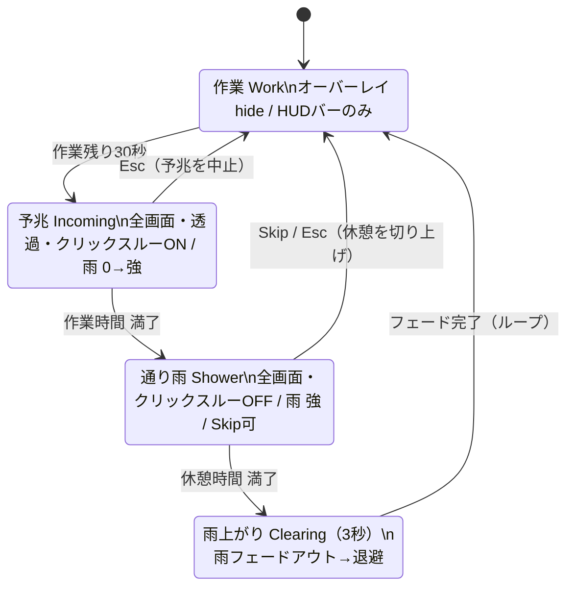
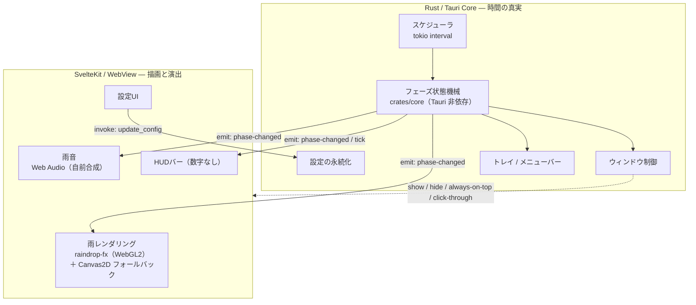

# 雨やどり（仮称） / Amayadori

> ポモドーロ型の作業タイマー × 窓ガラスを流れる雨のアンビエント表現。
> 集中中は隅の穏やかなバーだけが残り時間を伝える。休憩30秒前から透過オーバーレイで雨が徐々に強まり（作業は継続可能）、休憩本体では雨が画面を覆う。
> ただし **Skip／Esc でいつでも抜けられる**。雨が上がれば静かに引っ込む。

<p align="center"><em>「通り雨が来たから少し手を止める」── 強制ではなく、誘いとしての休憩。</em></p>

---

## ダウンロード

[](https://github.com/katusaburou/Rainbreak/releases/latest)

**▶ [最新版をダウンロード（GitHub Releases）](https://github.com/katusaburou/Rainbreak/releases/latest)**

| OS | ファイル | 備考 |
|---|---|---|
| **macOS**（Apple Silicon） | `..._macOS_AppleSilicon.dmg` | M1 以降 |
| **macOS**（Intel） | `..._macOS_Intel.dmg` | Intel Mac |
| **Windows** | `..._Windows_Setup.exe` | Windows 10/11 |

> `..._Update.app.tar.gz`・`.sig`・`latest.json` は自動アップデートの配信用ファイルです。手動でダウンロードする必要はありません。

> **初回リリース（v0.1.0）は公開準備中です。** インストーラのビルド〜ドラフト作成までは CI で確認済みで、公開後に上記リンクの **Assets** から各OSのインストーラを取得できます。過去版は [リリース一覧](https://github.com/katusaburou/Rainbreak/releases) から。
> **未署名配布**のため、初回起動時はOSの警告回避が必要です → [インストール手順](#インストール)。

---

## これは何か

**雨やどり**は、ポモドーロ型の作業タイマーと、窓ガラスを流れる雨のアンビエント表現を組み合わせた **macOS / Windows 向けのデスクトップ常駐アプリ**です。

- 集中中は、画面の隅に置いた**数字なしの穏やかなバー**だけが時間の経過を静かに伝えます。画面の大半には何も出しません。
- 休憩が近づくと、**透過した雨が画面に重なって徐々に強まり**ます（＝予兆）。このとき作業は止まりません。
- 休憩本体では**雨が画面を覆って**休息を促します。それでも Skip／Esc でいつでも作業に戻れます。
- 雨が上がれば静かに引っ込み、次の作業へ戻ってループします。

梅雨どきのしんみりした空気感を基調に、集中と休息のリズムをやわらかく区切ることを目的としています。

> 仮称「雨やどり」。名称は未確定です。

> **開発状況（2026年6月時点）**: MVP の機能実装と配布 CI は一通り完了しています。残るは初回リリースの公開と実機検証です → [実装状況 / ロードマップ](#実装状況--ロードマップ)。

---

## コンセプト / 世界観

| | |
|---|---|
| **テーマ** | 梅雨の通り雨。休憩＝雨やどり。 |
| **トーン** | 静か、しんみり、急かさない。 |
| **中核体験** | 作業（隅に穏やかなバー）→ 透過の雨が30秒かけて近づく予兆 → 通り雨で休息 → 雨上がり → 作業、の反復。 |
| **設計原則** | 休息は強制ではなく誘い。逃げ場（Skip／中断）を必ず残す。 |

---

## 特徴 — 2本の楔

時間を一切表示せず休憩をブラーで受動的に促す既存アプリ（Jun 等）や、強制中断する系（Stretchly 等）に対し、雨やどりの差別化は次の2本に固定しています。両者は層が異なるため競合せず、互いを補強します。

### (A) 予兆という「移行」の発明
休憩はいきなり来ません。**休憩30秒前から雨が近づき**、作業を続けたまま「もうすぐ通り雨」を体で察知できます。「いきなり降る」のとも「強制中断」とも違う、滑らかな移行の設計です。

### (B) 集中中の穏やかな常時バー
時間を隠すのではなく「見せる、ただし穏やかに」。隅に**数字なしの連続バー**を常駐させ、ゴールが近づく感覚（goal-gradient）で集中を後押しします。**表示専用・常時クリックスルー**なので、操作は一切妨げません。

> 純ミニマル路線（集中中も何も出さず、差別化を (A) 予兆の一点に寄せる）は **ビルド時の分岐**として残しますが、既定は **(A)+(B) 併用**です（ユーザー設定にはしません）。

---

## 体験フロー（状態遷移）

4つのフェーズを Rust 側の状態機械（`crates/core`・早送りの単体テストで遷移を固定）が駆動します。**時間の真実は常に Rust 側**にあり、WebView は描画と演出に専念します。



| フェーズ | 全画面オーバーレイ | 隅HUD（バー） | always-on-top | クリックスルー | 雨 | 音 | 操作 |
|---|---|---|---|---|---|---|---|
| **作業** | hide | 表示（残り＝作業バー） | HUDのみ | — | なし | OFF | — |
| **予兆**（30秒） | 全画面・透過 | 表示（ほぼ満了） | ON | **ON** | 0→強へ漸増 | なし | 後ろのアプリ操作可（作業継続） |
| **通り雨**（休憩） | 全画面 | 非表示 | ON | **OFF** | 強 | フェードイン | **Skip／Esc で作業へ** |
| **雨上がり**（3秒） | 全画面→hide | 作業復帰時に再表示 | ON→OFF | OFF | 強→消滅 | フェードアウト | — |

---

## アーキテクチャ



**なぜこの分担か**: 非表示 WebView の JS タイマーはスロットリングで周期がズレるため、時間管理を Rust（tokio）側に置きます。フロントはイベントを受けて雨・HUD・音・UI を反映するだけで、時間を持ちません。

---

## 技術スタック

| レイヤ | 採用 | 理由（要約） |
|---|---|---|
| シェル | **Tauri 2** | 常駐フットプリントが決め手。インストーラ10MB未満・メモリ30〜50MB（Electron は80〜150MB／150〜300MB）。 |
| フロントエンド | **SvelteKit** | そのまま動作。増える Rust 表面積は小さい。 |
| 雨描画 | **raindrop-fx**（WebGL2）＋ Canvas2D フォールバック | 背景の静止画を屈折元に使う「モードA」。粒の合体・蛇行滑落・トレイルはライブラリが担い、雨脚 0..1 をパラメータへ写像。WebGL2 が無い環境と reduced-motion 時は追加依存なしの Canvas2D 簡易版へ自動フォールバック。 |
| スケジューラ | **Rust**（tokio interval） | バックエンド駆動でタイマー精度を担保。状態機械は `crates/core` に分離し単体テスト。 |
| 音 | **Web Audio**（自前合成） | 擬似ピンクノイズ＋ローパスで雨音を合成（音声アセット・外部ライブラリ不使用）。フェードイン／アウト。 |

> **Electron を選ぶ条件**（不採用理由の裏返し）: Linux 含む全OSで WebGL を盤石にしたい、または Rust を一切入れたくない場合のみ。本件はどちらにも当たりません。

---

## 動作環境

| 項目 | 内容 |
|---|---|
| 対応OS | **macOS（WKWebView）／ Windows 10 1803以降・11（WebView2）**。**Linux は対象外**。 |
| WebView2（Windows） | 11 は全機プリインストール。10 にも配布済みだが、ごく一部は未導入 → Tauri インストーラが `downloadBootstrapper` で自動導入。 |
| パフォーマンス | 作業中（雨なし）・非表示・被覆時は描画を完全停止して省電力。Canvas2D フォールバックは 30fps 上限（raindrop-fx は内部 rAF 駆動）。 |
| アクセシビリティ | `prefers-reduced-motion` を**自動で尊重**（演出を簡略化／無効化）。Skip／Esc を常備し、ユーザーを閉じ込めない。 |

---

## インストール

> インストーラは **[最新リリース](https://github.com/katusaburou/Rainbreak/releases/latest)** の Assets から取得します。
> 現状は **未署名配布**です。OSの警告を回避する手順を以下に示します。署名は将来段階的に追加予定（[配布](#配布--リリース)参照）。

### macOS（`.dmg`）
1. `.dmg` を開き、アプリを「アプリケーション」へドラッグ。
2. **方法A（初回のみ・右クリック）**: アプリを右クリック →「開く」→ ダイアログで「開く」。2回目以降は通常起動。
3. **方法B（macOS Sequoia 以降・GUI）**: 最新の macOS（15 Sequoia）では右クリック→「開く」が使えなくなりました。次の手順で起動します。
   1. アプリを一度ダブルクリックする（警告が出るので閉じる）。
   2. **システム設定 → プライバシーとセキュリティ** を開く。
   3. 下の方の「"雨やどり" は開発元を確認できないため開けませんでした。」の右にある **「このまま開く」** をクリック。
   4. 確認ダイアログで再度 **「このまま開く」**（Touch ID／パスワードを求められたら認証）。2回目以降は通常起動。
4. **「壊れているため開けません」と出る場合**は、ターミナルで隔離属性を外す：
   ```sh
   xattr -dr com.apple.quarantine /Applications/雨やどり.app
   ```

### Windows（`..._Windows_Setup.exe`）
1. `..._Windows_Setup.exe` を実行。
2. 「Windows によって PC が保護されました」が出たら →「詳細情報」→「実行」。

---

## 開発

### 前提
- Node.js（LTS）＋ pnpm（または npm）
- Rust ツールチェーン（`rustup`）
- 各OSの Tauri 前提（[Tauri 2 prerequisites](https://v2.tauri.app/start/prerequisites/) 参照）

### セットアップ & 実行
```sh
pnpm install                     # フロント依存
node tools/gen-assets.mjs        # 背景・アイコン素材を生成（初回のみ）
pnpm tauri icon app-icon.png     # 各OS用アイコンを生成（初回のみ）
pnpm tauri dev                   # 開発起動（HMR + Rust ホットリロード）
pnpm tauri build                 # 各OSインストーラを生成
```

> アイコン（`src-tauri/icons/`）と素材は生成物のため git 管理外です。`pnpm tauri dev/build` の前に上記の生成コマンドを一度実行してください（CI は自動で実行します）。

> Tauri を介さないブラウザプレビューも可能です: `pnpm dev` で `http://localhost:5173/overlay?phase=shower` のように開くと、dev ビルド限定の `?phase=` クエリでフェーズを手動再現できます（Tauri 外ではフェーズイベントが届かないため）。

### テスト / チェック
```sh
cargo test --manifest-path crates/core/Cargo.toml   # 状態機械の単体テスト
pnpm run check                                       # フロントの型チェック
pnpm run build                                       # 静的SPAビルド
```

### ディレクトリ構成
```
Rainbreak/
├─ src/                       # SvelteKit フロント（描画・演出のみ）
│  ├─ routes/
│  │  ├─ overlay/+page.svelte # 全画面・雨オーバーレイ窓
│  │  ├─ hud/+page.svelte     # 隅のHUDバー窓
│  │  └─ settings/+page.svelte# 設定窓
│  └─ lib/
│     ├─ rain/                # フレームワーク非依存の雨モジュール（将来のWeb版と共有）
│     ├─ audio/               # 雨音（Web Audio で合成）
│     ├─ ipc/                 # Tauri event/command ラッパ + 型
│     └─ motion.ts            # prefers-reduced-motion
├─ crates/core/               # 時間の真実: 状態機械（Tauri 非依存・単体テスト対象）
│  └─ src/phase.rs            # Work/Incoming/Shower/Clearing の遷移
├─ src-tauri/                 # Tauri シェル（Rust）
│  └─ src/
│     ├─ main.rs              # セットアップ・プラグイン・ウィンドウ・トレイ登録
│     ├─ scheduler.rs         # tokio interval（1s tick）
│     ├─ glue.rs              # イベント emit + フェーズ遷移の副作用集約
│     ├─ windows.rs           # ウィンドウ制御（show/hide/最前面/クリックスルー）
│     ├─ shortcuts.rs         # グローバル Esc
│     ├─ tray.rs              # トレイ・メニュー
│     ├─ commands.rs          # #[tauri::command]
│     ├─ config.rs            # 設定の永続化
│     └─ state.rs             # 共有状態
├─ static/bg/                 # ぼかし背景の静止画（屈折元）
├─ tools/
│  ├─ gen-assets.mjs          # 背景・アイコン素材の生成（依存なし）
│  └─ rename-release-assets.mjs # Release アセット名を分かりやすく整備（release.yml が実行）
├─ .github/workflows/         # ci.yml（テスト/ビルド）・release.yml（tauri-action）
└─ docs/                      # 要件定義・実装計画
```

> 「時間の真実」は `crates/core` に分離し、Tauri 非依存で単体テストできるようにしています（実装計画 §4）。`src-tauri` はこのコアを駆動して描画窓へイベントを配信するシェルです。

詳細な段取りは **[docs/implementation-plan.md](docs/implementation-plan.md)** を参照してください。

---

## 設定（最小）

設定は「道具を管理させる」負債と捉え、**美的パラメータ（背景・雨量・演出強度）は作者が決め打ち**し、設定から外しています。残すのは次の3点のみで、値は永続化します。

- **作業時間 / 休憩時間**（デフォルト **20分 / 5分**）── 唯一の機能的可変項目。
- **音量 / ミュート** ── 好みではなく基本操作。
- **起動時の自動開始 ON/OFF** ── 常駐アプリの標準的利便。

---

## 実装状況 / ロードマップ

**2026年6月時点**: MVP の機能は一通り実装済みです。コアの状態機械は早送りの単体テスト（14件）で遷移を固定し、CI とリリースワークフロー（インストーラのビルド〜ドラフト作成）も動作確認済み。残るは実機検証ゲートと初回リリースの公開です。

### 実装済み（MVP）
- [x] 設定可能な 20/5 サイクル（`crates/core` の状態機械 ＋ tokio の1秒 tick。WebView は時間を持たない）
- [x] 4フェーズ（作業／予兆30秒／通り雨／雨上がり3秒）とウィンドウ連動（最前面・クリックスルー・表示/退避の切替）
- [x] 雨描画（自前背景1枚 ＋ raindrop-fx。WebGL2 が無い環境と reduced-motion 時は Canvas2D 簡易版へ自動フォールバック）
- [x] 隅の HUD バー（数字なし・常時クリックスルー・終盤だけ暖色へ寄る goal-gradient）
- [x] 雨音（Web Audio で合成。通り雨でフェードイン／雨上がりでフェードアウト、音量・ミュートを即時反映）
- [x] トレイ常駐 ＋ 残り時間表示（ツールチップにフェーズと mm:ss。一時停止/再開・Skip・設定・終了）
- [x] Skip／Esc（Esc はグローバルショートカット。作業中は登録解除して他アプリの Esc を奪わない）
- [x] 設定UIと永続化（サイクル長・音量/ミュート・自動起動。OS 設定ディレクトリの JSON）
- [x] `prefers-reduced-motion` の自動尊重（雨を静的表示へ簡略化）
- [x] CI（状態機械テスト／フロント型チェック・ビルド／mac・win コンパイル検証）とリリースワークフロー（tauri-action）
- [x] 自動アップデート（起動時チェック＋確認ダイアログ、トレイの「アップデートを確認…」。配信には署名鍵の Secrets 登録が必要 → [配布 / リリース](#配布--リリース)）

### 公開前の残作業
- [ ] 実機検証ゲート — 特に macOS 全画面共存はネイティブ実装が未着手（詳細は下記「⚠️ 技術検証ゲート（未了）」）
- [ ] 初回リリース v0.1.0 の公開（ドラフト作成までは確認済み）
- [ ] 背景静止画の差し替え（現在は `tools/gen-assets.mjs` が生成するプレースホルダ）

### 後続（拡張）
- 予兆の演出磨き込み
- サイクル統計
- （必要なら）コード署名

> **roadmap から除外**: 集中中ずっと薄い雨を重ねる「雨の作業モード」。常時降雨は予兆ランプの可読性と排他になり、(B) の HUD バーが集中中の時間提示を担うため採りません。

---

## 配布 / リリース

- **GitHub Releases ＋ `tauri-apps/tauri-action`**。macOS(Arm/Intel)・Windows のインストーラをビルド → Release（ドラフト）作成＆アップロードまで自動化。起動方法は2通り:
  - **タグ push**: `git tag v0.1.0 && git push origin v0.1.0`（`v*` で発火）。
  - **手動実行**: GitHub の **Actions → release → Run workflow** で `version`（例 `v0.1.0`）を入力。タグを push できない環境向け。実行したコミットに同名タグを作成する。
  - いずれもドラフトのリリースが作られるため、内容を確認して **Publish** すると一般公開される。
  - 初回の **v0.1.0 はこのフローでドラフト作成まで確認済み**（未公開）。
- 生成物: macOS `.dmg`（Apple Silicon / Intel）、Windows `Setup.exe`（NSIS）。ビルド後の `rename-assets` ジョブが `tools/rename-release-assets.mjs` で OS の分かるアセット名（`..._Windows_Setup.exe` / `..._macOS_AppleSilicon.dmg` など）へ揃え、`latest.json` 内の URL も追随させる。
- **未署名で配布**し、本 README とリリースノートに手順を明記。

### 自動アップデート

`tauri-plugin-updater` による自動アップデートを実装済み。アプリは起動約10秒後と、トレイの「アップデートを確認…」で Release 同梱の `latest.json` を確認し、新版があれば確認ダイアログ → 同意でダウンロード・適用・再起動する。

- **更新の真正性は Tauri 更新署名鍵（minisign）で検証**する。OS のコード署名とは別物で、未署名配布のままでも動作する（macOS はアプリ自身が置き換えるため quarantine が付かず、Windows は NSIS をサイレント実行）。
- **配信に必要な一度きりの準備**: リポジトリ **Settings → Secrets and variables → Actions** に、`tauri signer generate` で生成した秘密鍵を **`TAURI_SIGNING_PRIVATE_KEY`** として登録する（公開鍵は `src-tauri/tauri.conf.json` に埋め込み済み）。**秘密鍵を紛失すると以後の更新を配信できない**ため必ず保管する。
- 配信開始のタイミング: ドラフト Release を **Publish した時点**で `releases/latest/download/latest.json` が解決可能になり、各クライアントに行き渡る。
- 各リリース前に `src-tauri/tauri.conf.json`・`src-tauri/Cargo.toml`・`package.json` のバージョンを上げてからタグを切る。
- 注意: 自動更新が効くのは updater 入りの版をインストールした利用者から。それ以前の版（素の v0.1.0 以前）には届かないため、手動での入れ直しを案内する。

### 将来のコード署名（任意・段階的）
- **macOS**: Apple Developer Program（年99ドル）→ Developer ID 署名＋notarization で Gatekeeper 警告を解消。
- **Windows**: **Azure Artifact Signing（旧 Azure Trusted Signing）は日本の個人・法人とも現在も対象外**。現実解は従来型 OV 証明書（年2〜4万円前後＋鍵の HSM/トークン保管）。EV の SmartScreen 即時回避特典は 2024 年に廃止済みで、署名しても評価が貯まるまで警告が出る点に留意。

---

## ⚠️ 技術検証ゲート（未了）

実装は骨格を先行させたため、設計の前提を支える次の2点は**実機検証が未了のまま残っています**。ここが転ぶと設計を組み替える必要があります。

1. **macOS：ユーザーの全画面アプリ上へのオーバーレイ表示。** 全画面エディタ／動画／Zoom の**上に**予兆・通り雨が出るか。必要なネイティブ実装（`NSWindowCollectionBehaviorFullScreenAuxiliary` ＋ `canJoinAllSpaces` ＋ window level）は**未着手**で、現状の overlay は「最前面＋maximize」のみ（`src-tauri/src/windows.rs` 参照）。**未達なら中核体験が発火しない最優先課題**。
2. **予兆 → 通り雨のクリックスルー切替の体感。** `setIgnoreCursorEvents` ON→OFF 切替時のクリック取りこぼし／誤クリックを mac / win 両方で確認。

> 副次的に、内蔵GPU 機での通り雨フルスクリーン時の実機FPS も測ります（raindrop-fx の粒数上限は計測結果で引き上げる前提の保守値）。詳細は実装計画 **Phase 0** を参照。

---

## ライセンス

未定（個人開発 / ポートフォリオ用途）。

---

*本書は要件定義 v3（[docs/requirements-v3.md](docs/requirements-v3.md)）に基づきます。開発フェーズに合わせて随時更新します。*
