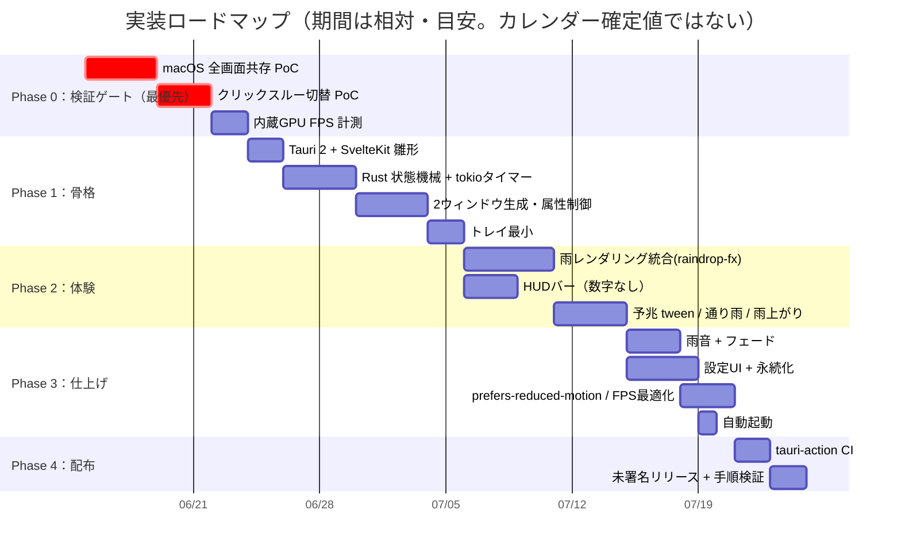
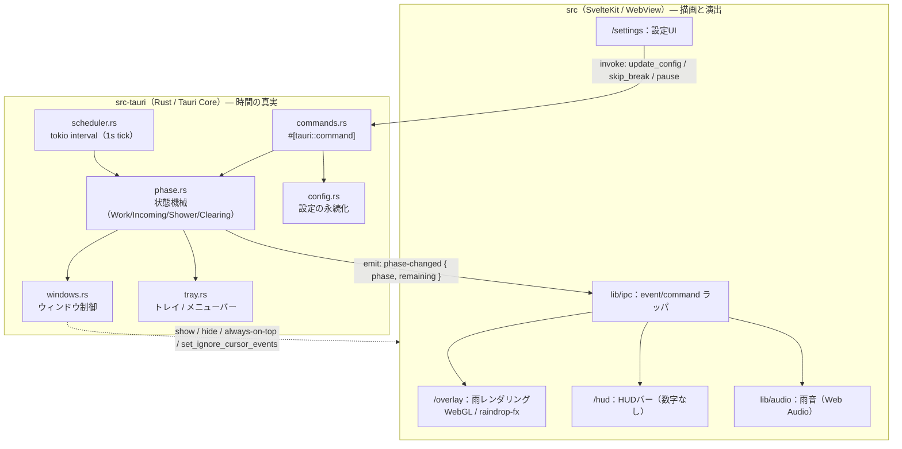
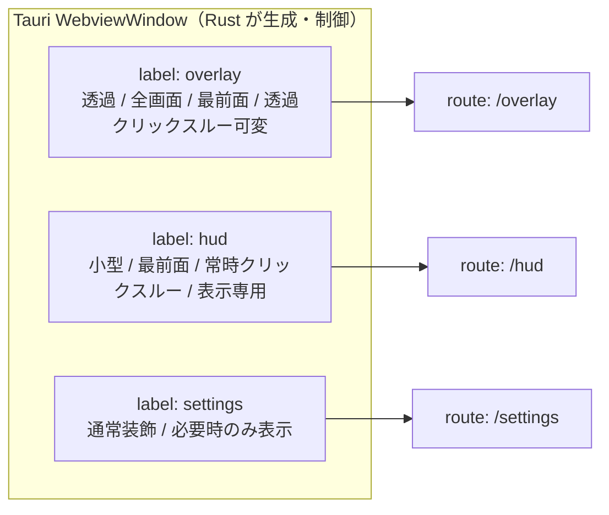
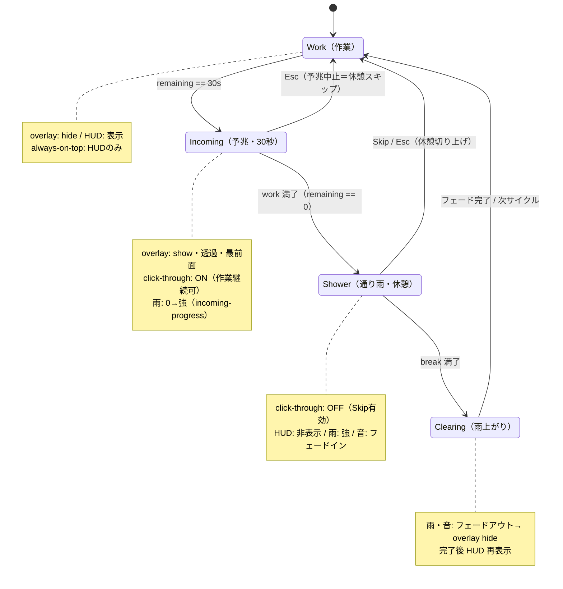
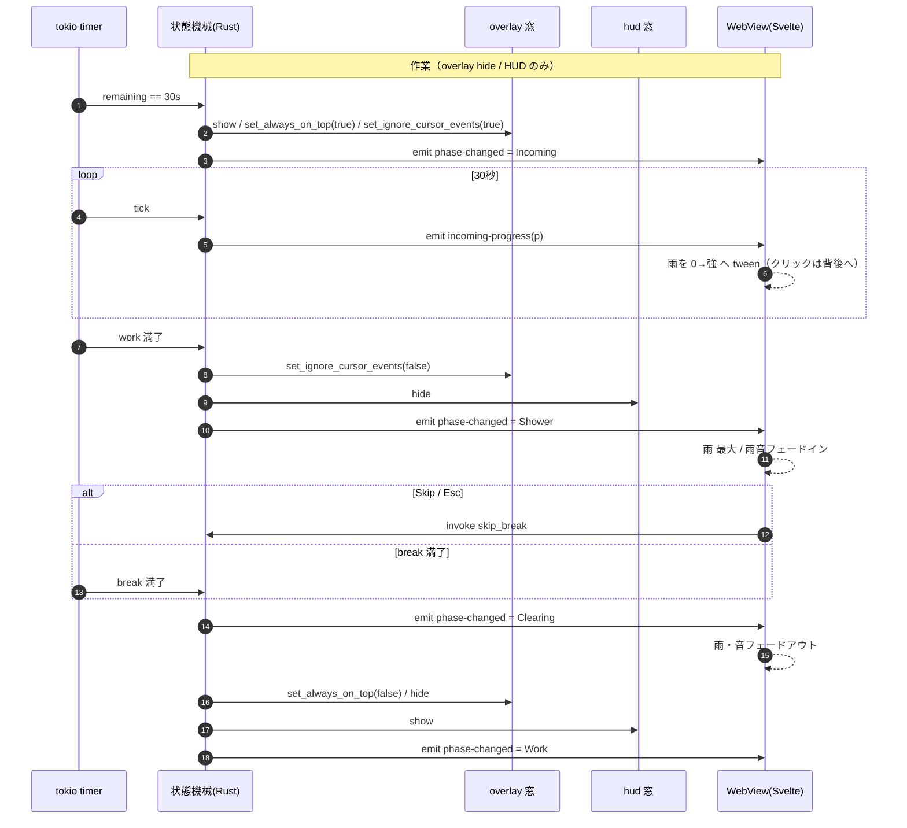
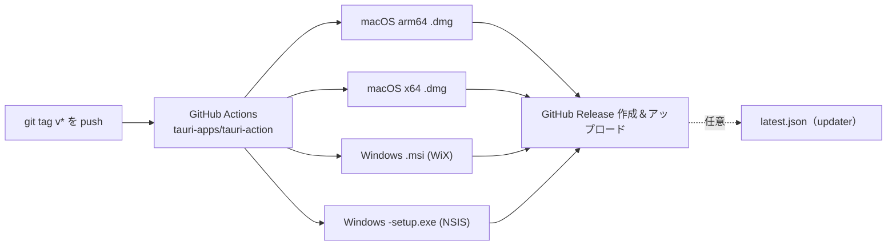

# 雨やどり（仮称） 実装計画

> 要件定義 v3（[requirements-v3.md](requirements-v3.md)）に基づく実装の段取り。
> 章番号（§x.x）は要件定義を指す。本書は開発フェーズに合わせて随時更新する。

---

## 0. この文書について

- **目的**: 要件 v3 を、着手順・モジュール分割・受け入れ条件に落とし込む。
- **大方針**: ①検証ゲートを最優先で潰す → ②骨格（時間の真実＝Rust）を立てる → ③体験（雨・HUD）を載せる → ④仕上げ（音・設定・トレイ・a11y） → ⑤配布。
- **不変の設計原則**:
  1. **時間の真実は Rust 側**（tokio）。WebView は描画・演出のみで時間を持たない（§6）。
  2. **クリックスルーはウィンドウ単位トグルのみ**。ピクセル単位のヒットテストはしない（§5.4）。
  3. **逃げ場を必ず残す**。Skip／Esc は通り雨で常に有効、操作ロックはしない（§3.5）。
  4. **美的パラメータは決め打ち**。設定に出さない（§3.6）。

---

## 1. マイルストーン全体像



| Phase | ゴール | 完了の合図 |
|---|---|---|
| **0** | 設計前提の検証 | mac 全画面上にオーバーレイが出る／切替に取りこぼしなし／内蔵GPUで目標FPS見込み |
| **1** | 時間とウィンドウの骨格 | フェーズが時刻で正しく遷移し、2窓の属性が表通りに切り替わる（雨は仮） |
| **2** | 中核体験 | 予兆→通り雨→雨上がりが雨とHUDで成立 |
| **3** | 製品の体裁 | 音・設定永続化・トレイ・a11y・省電力 |
| **4** | 配布 | タグ push で mac/win インストーラが自動生成され、手順通り起動できる |

---

## 2. Phase 0：技術検証ゲート（着工前に潰す）

> ここが転ぶと設計を組み替える必要がある（§11）。各ゲートは**捨てる前提の最小プロト**で確認し、本実装には持ち込まない。

### Gate 1 — macOS 全画面共存【最優先・ブロッカー】
- **問い**: ユーザーのネイティブ全画面アプリ（全画面エディタ／動画／Zoom）の**上に**、透過オーバーレイと通り雨が前面表示されるか。
- **検証手段**: `NSWindowCollectionBehaviorFullScreenAuxiliary` ＋ `canJoinAllSpaces` ＋ 適切な window level の組み合わせ。Tauri から `tauri-nspanel` 系または `objc`/`cocoa` クレート経由で `NSWindow` の `collectionBehavior` / `level` を設定して確認。
- **合格基準**: 別アプリの全画面 Space に切り替えても、オーバーレイが前面に重なって見える。
- **フォールバック（不合格時）**: 「全画面アプリ検知中は予兆をスキップし、トレイ通知へ降格」を設計に追加（§11）。この分岐の有無で Phase 1 のウィンドウ制御の作りが変わるため、**最初に確定させる**。
- **状況（2026-06）**: 骨格を先行させた経緯から、捨てプロトではなく本実装へ直接組み込んだ（2 窓の構成が既にあるため）。`src-tauri/src/macos.rs` が `collectionBehavior`（canJoinAllSpaces ＋ fullScreenAuxiliary）と `sharingType` を設定し、overlay は非キー表示（フォーカス非奪取）・モニタ全域カバーに変更済み。window level は逃げ場（トレイ・Zoom UI）を塞がないよう Floating のまま。**実機での合否確認が未了** — 手順は [macos-fullscreen-gate.md](macos-fullscreen-gate.md)。

### Gate 2 — クリックスルー切替の体感
- **問い**: `setIgnoreCursorEvents` を予兆 ON → 通り雨 OFF に切り替える瞬間、クリックの取りこぼし・誤クリック（背後へ抜ける／抜けない）がないか。
- **検証手段**: 全画面透過窓 ＋ 背後にテキストエディタ。切替直後のクリックがどちらに届くかを mac / win 両方で観察。
- **合格基準**: 予兆中のクリックは確実に背後へ、通り雨化後の最初のクリックは確実にオーバーレイ（Skip）へ。境界での1クリック取りこぼしを許容範囲に収める。

### Gate 3 — 内蔵GPU FPS（副次・同じプロトで）
- **問い**: 内蔵GPU機で通り雨フルスクリーン時、30fps を保てるか。
- **検証手段**: raindrop-fx をフルスクリーン透過窓で回し、フレーム時間を実測。
- **合格基準**: 30fps 目安を満たす。未達なら雨量／屈折品質を落とす方針を数値で持っておく（§4）。

**Phase 0 の Exit 条件**: Gate 1 の可否（＝予兆を全画面アプリ上に出せるか）と、その結果のフォールバック要否が**確定**していること。

---

## 3. アーキテクチャ詳細

### 3.1 責務分担



- **Rust が持つもの**: 現在フェーズ、残り秒、サイクル長、ウィンドウのハンドルと属性、トレイ、設定の読み書き。
- **WebView が持つもの**: 雨の見た目、HUDバーの充填率、音、設定フォーム。**残り時間は受け取った値を描くだけ**（自前カウントダウンを持たない）。

### 3.2 2ウィンドウ＋設定ウィンドウのマッピング



- SvelteKit は static adapter（SPA）でビルドし、各ウィンドウに別ルートを読み込ませる。
- `overlay` と `hud` は**別ウィンドウ**（属性が根本的に違うため）。HUD を overlay に同居させない（HUD は常時クリックスルー＝表示専用、overlay はクリックスルーを切り替えるため）。

### 3.3 IPC 設計

**Rust → Front（events, emit）**
| イベント | ペイロード | 用途 |
|---|---|---|
| `phase-changed` | `{ phase, remaining_secs, cycle }` | フェーズ遷移時。各窓が見た目を切替 |
| `tick` | `{ phase, remaining_secs }` | 毎秒。HUDバーの充填率・トレイ残り時間 |
| `incoming-progress` | `{ p: 0.0..1.0 }` | 予兆の雨漸増の進捗（30秒を 0→1 で） |
| `config-changed` | `{ config }` | 設定更新の反映 |

**Front → Rust（commands, invoke）**
| コマンド | 引数 | 用途 |
|---|---|---|
| `skip_break` | — | 通り雨／予兆を切り上げ作業へ |
| `pause` / `resume` | — | タイマー一時停止・再開 |
| `update_config` | `{ work_min, break_min, volume, muted, autostart }` | 設定更新＋永続化 |
| `get_config` | — | 起動時取得 |
| `quit` | — | 終了 |

> Esc はフロントのキーハンドラ（通り雨ルート）→ `skip_break` を invoke、もしくは Rust 側のグローバルショートカットのいずれか。予兆中もキャンセルできるよう、**Esc はグローバルショートカット**を第一候補とする（予兆はクリックスルーONでフォーカスを持たないため）。

---

## 4. 状態機械の実装（phase.rs）



### 実装メモ
- フェーズは `enum Phase { Work, Incoming, Shower, Clearing }`。状態 ＋ `remaining_secs` ＋ `cycle_count` を `Mutex`/`RwLock` で保持（または actor 風に mpsc で集約）。
- 駆動は **tokio `interval(Duration::from_secs(1))`**。各 tick で `remaining_secs` を減算し、境界で遷移関数を呼ぶ。
- **境界条件**:
  - Work で `remaining == 30` → `Incoming` へ（予兆開始）。※予兆は作業の最後の30秒に**重なる**（別カウントではない）。
  - Work の `remaining == 0`（＝予兆も満了） → `Shower`（break タイマー開始）。
  - Shower の `remaining == 0` → `Clearing`。
  - Clearing はフェードアウト完了通知（フロントの演出尺）を待って `Work` へ。フェード尺は Rust が固定値で持ち、タイマーで遷移（フロント完了通知に依存しすぎない）。
- **Skip / Esc**: どのフェーズでも `→ Work`。`Incoming` からの Skip は「この通り雨を見送る」＝次の Work サイクルへ。タイマーは新しい Work として再スタート（MVP の割り切り。§10 の割り込み精緻化は後続）。
- **pause/resume**: interval を止めるのではなく「減算しないフラグ」で実装すると状態が単純。

### テスト（Phase 1 で）
- 時刻を注入できるよう、tick を抽象化（`Clock` trait など）し、**早送りでフェーズ遷移を単体テスト**。実時間に依存しない。
- 異常系: Skip 連打、pause 中の Skip、サイクル長変更の即時反映。

---

## 5. ウィンドウ制御の実装（windows.rs）

フェーズごとに2窓（＋設定）の属性を切り替える。属性は §7 の表が正。



### OS別の要点
| 事項 | macOS | Windows |
|---|---|---|
| 全画面共存 | `collectionBehavior`（`FullScreenAuxiliary`＋`canJoinAllSpaces`）＋ window level。**Gate 1 の結果に従う** | 通常の topmost で足りる想定。要実機確認 |
| 透過 | バンドル後に透過が外れる既知 issue → `macOSPrivateApi: true` 等を確認（§5.5） | 2.0 安定版で透過修正済み。フレームレス＋ドラッグの不具合は本設計外 |
| クリックスルー | 完全透明ピクセルは自動で背面へ抜ける → 予兆が素直に効く | `set_ignore_cursor_events` で対応 |
| 全画面化方式 | OSフルスクリーン vs 装飾なし maximize は §10 未確定 → **柔らかさ優先で maximize を第一候補**、要実機確認 | 同左 |

### MVP の割り切り（§10）
- **マルチモニタ**: 主モニタのみを覆う。
- **フォーカス**: 通り雨入りで**フォーカスは奪わない**方向（思考の中断回避）。クリックのみ受ける。要実機確認。

---

## 6. 雨レンダリング（lib/rain）

- **モードA**（自前背景・静止画1枚）。`static/bg/` のぼかし風景を屈折元テクスチャに使う。
- **ライブラリ**: `raindrop-fx`（WebGL2、屈折・ミスト・生成レート設定済み）をそのまま採用。背景差し替えで成立。
- **フレームワーク非依存**: 雨モジュールは Svelte に依存しない素の TS クラスとして実装し、`init(canvas, bgTexture)` / `setIntensity(0..1)` / `start()` / `stop()` のような API に。**将来のブラウザ版とコア共有**（§5.3）。
- **フェーズ連動**:
  - 予兆: `incoming-progress` の `p` を `setIntensity(p)` に渡し 0→強。
  - 通り雨: 強で維持。必要なら濃度／背景を強める。
  - 雨上がり: 強→0 へ tween 後 `stop()`。
- **省電力（§4）**: 作業・非表示・被覆時は `requestAnimationFrame` ループを止める。FPS上限30。`document.visibilityState` と Rust の hide を併用して**確実に停止**。

---

## 7. HUDバー（/hud）

- **見た目**: 数字なしの連続バー。作業の残り割合（`remaining/work_total`）で充填。隅に小さく。
- **挙動**: `tick` を受けて充填率を更新。Work と Incoming で表示、Shower で非表示、Clearing 完了で再表示。
- **ウィンドウ**: 小型・最前面・**常時クリックスルー**・表示専用。ヒットテスト不要（§5.4）。ドラッグ移動はMVP対象外（位置は決め打ち）。
- **goal-gradient**: 終盤でわずかに色味/輝度を寄せる程度の控えめな演出（美的パラメータは決め打ち、設定に出さない）。

---

## 8. 音（lib/audio）

- Web Audio（必要なら Tone.js）。雨音ループを1本。
- 通り雨開始でフェードイン、雨上がりでフェードアウト（§3.4）。予兆は任意で小音量。
- 音量／ミュートは設定値（§3.6）に従う。`GainNode` で実装。
- 自動再生制約: 起動直後はユーザー操作が要る場合があるため、初回フェーズ遷移までに AudioContext を resume する導線を用意。

---

## 9. 設定（config.rs / /settings）

- **項目（最小）**: `work_min`（既定20）/ `break_min`（既定5）/ `volume` / `muted` / `autostart`。**これだけ**（§3.6）。
- **永続化**: `tauri-plugin-store` か OS 設定ディレクトリの JSON。起動時 `get_config`、変更時 `update_config` で保存＋ `config-changed` emit。
- **自動起動**: `tauri-plugin-autostart`。
- **prefers-reduced-motion（§4）**: 設定にはしない。フロントで `window.matchMedia('(prefers-reduced-motion: reduce)')` を見て、雨演出を簡略化／無効化（静止 or 弱）し、フェードも短縮。
- **やらないこと**: 背景・雨量・演出強度をUIに出す。サイクル中の割り込み細設定。

---

## 10. トレイ / メニューバー（tray.rs）

- 常駐アイコン。ツールチップ／メニューに**現在フェーズ・残り時間**（`tick` 由来）。
- メニュー: 開始 / 一時停止 / Skip / 設定 / 終了（§3.7）。
- 残り時間の把握は「集中中＝HUDバー」「いつでも＝トレイ」の二段（§3.1）。

---

## 11. 配布 / CI（Phase 4）



- **トリガ**: バージョンタグ（`v*`）push（§8）。
- **生成物**: mac `.dmg`、win `.msi` / `-setup.exe`。
- **未署名配布**: README とリリースノートに手順を明記（mac の右クリック開く／`xattr` 除去、win の SmartScreen 回避）。
- **自動アップデート（後続）**: updater プラグイン＋`includeUpdaterJson: true` で `latest.json` 同梱。`TAURI_SIGNING_PRIVATE_KEY`（更新用署名鍵、OSコード署名とは別物）を Secrets に。
- **実機確認（重要・§5.5）**: ビルド後の実機で**透過挙動**を確認。mac はバンドル後に透過が外れる既知 issue があるため `macOSPrivateApi` 等を確認。

---

## 12. ディレクトリ構成（確定案）

```
雨やどり/
├─ src/                          # SvelteKit（描画・演出のみ）
│  ├─ routes/
│  │  ├─ overlay/+page.svelte    # 全画面・雨オーバーレイ
│  │  ├─ hud/+page.svelte        # 隅のHUDバー
│  │  └─ settings/+page.svelte   # 設定
│  └─ lib/
│     ├─ rain/                   # フレームワーク非依存の雨モジュール（TS）
│     ├─ audio/                  # 雨音（Web Audio）
│     └─ ipc/                    # event/command ラッパ + 型
├─ src-tauri/
│  ├─ src/
│  │  ├─ main.rs                 # セットアップ・ウィンドウ生成・トレイ登録
│  │  ├─ phase.rs                # 状態機械（Work/Incoming/Shower/Clearing）
│  │  ├─ scheduler.rs            # tokio interval / Clock 抽象
│  │  ├─ windows.rs              # show/hide/最前面/クリックスルー/全画面
│  │  ├─ tray.rs                 # トレイ・メニュー
│  │  ├─ commands.rs             # #[tauri::command]
│  │  └─ config.rs               # 設定の永続化
│  ├─ tauri.conf.json            # 2窓定義 / macOSPrivateApi / updater 等
│  └─ Cargo.toml
├─ static/bg/                    # ぼかし背景の静止画（屈折元・決め打ち）
├─ .github/workflows/release.yml # tauri-action
├─ docs/
│  ├─ requirements-v3.md         # 正本
│  └─ implementation-plan.md     # 本書
└─ README.md
```

---

## 13. リスクと未確定事項（§10・§11 の追跡）

| 項目 | 状態 | 扱い |
|---|---|---|
| **mac 全画面共存**（Gate 1） | 未検証・**ブロッカー** | Phase 0 で確定。不可なら予兆をトレイ通知に降格する分岐を実装 |
| クリックスルー切替の体感（Gate 2） | 未検証 | Phase 0 で確認。境界の取りこぼし許容範囲を決める |
| 内蔵GPU FPS（Gate 3） | 未検証 | Phase 0 で実測。未達時の品質ダウン方針を数値化 |
| 全画面化方式（OS FS vs maximize） | 未確定 | maximize を第一候補、実機で確定（§10） |
| マルチモニタ | MVP 範囲外 | 主モニタのみ。後続 |
| フォーカス奪取 | 未確定 | 奪わない方向、実機確認（§10） |
| 割り込み精緻化（idle 検知） | 後続 | MVP は固定タイマー（§10） |
| 名称 | 仮称 | 「雨やどり」 |

---

## 14. MVP 完了の定義（Definition of Done）

- [ ] 20/5（設定で可変）のサイクルが Rust 駆動で正確に回る（非表示でもズレない）。
- [ ] 作業：overlay hide ＋ HUDバー表示、他アプリ操作を妨げない。
- [ ] 予兆：全画面・透過・**クリックスルーON**で雨が 0→強、**作業継続可**、HUD 表示。
- [ ] 通り雨：**クリックスルーOFF**で雨が覆い、**Skip／Esc が効く**、HUD 非表示、雨音フェードイン。
- [ ] 雨上がり：雨・音フェードアウト → overlay hide → HUD 再表示 → 作業へループ。
- [ ] トレイ常駐＋残り時間表示、開始/一時停止/Skip/設定/終了。
- [ ] 設定（サイクル長・音量/ミュート・自動起動）が永続化される。
- [ ] `prefers-reduced-motion` を自動尊重。
- [ ] タグ push で mac `.dmg` / win `-setup.exe` が自動生成され、手順通りに起動できる。
- [ ] （Phase 0 で）mac 全画面アプリ上にオーバーレイが出る／出ない場合のフォールバックが入っている。

---

*本書は requirements-v3 に従属する。仕様変更は requirements-v3 を先に更新し、本書へ反映する。*
